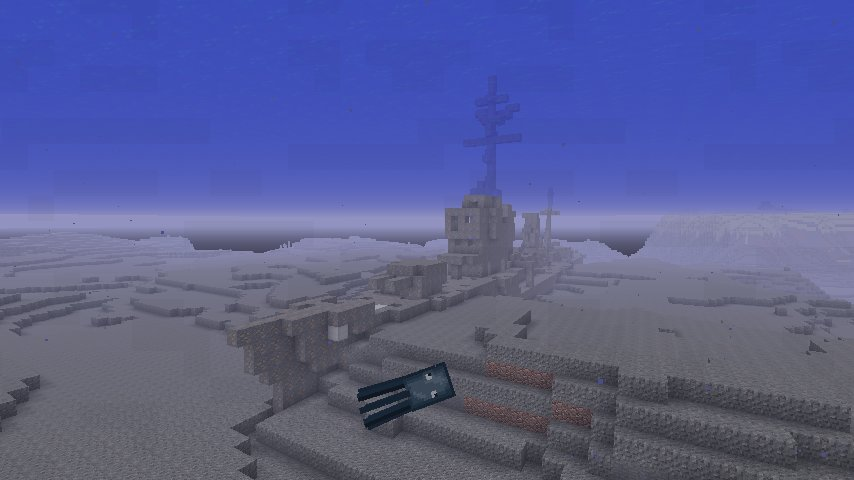

# SunkenNavalShips
[](docs/img/sunkennavalships.jpg)

SunkenNavalShipsはMinecraftの世界に沈没艦を生成するmodです。

## Versions
- v 1.2.0 for Minecraft 1.12(.x)

## Downloads
Releasesページの**Assets**にある **SunkenNavalShips-(Minecraftバージョン)-(modバージョン).jar** をクリックしてください。

- [Releases (from GitHub)](https://github.com/Iunius118/SunkenNavalShips/releases)

## Features
- このmodを導入すると、海洋・深海バイオームに一定確率で「沈没艦」が生成されるようになります
- 生成される沈没艦は（なぜか）現実世界の20世紀前半に建造された海軍の駆逐艦に似ています
- 各艦は沈没してから長い時間が経っているらしく、船体は損傷し大部分が鉄鉱石ブロックによって構成されています
- 沈没艦の生成率はゲーム内configでも変更することができます（シングルプレイ時）
- マルチプレイに対応しています（サーバー側のみの導入でOKです）

## Description
### 生成される沈没艦について
以下の文書を参照してください。

- [docs/ships.md](docs/ships.md)

### Configuration
シングルプレイでは、ゲームメニューのmodリストからSunkenNavalShipsを選択し、Configボタンを押すと設定画面に移動します。
設定画面では以下の項目が変更できます。

- sunkenShipProbability
  - 沈没艦の生成確率を設定します
  - 値は0～100の整数で、大きいほど生成確率が高く、また0に設定すると沈没艦を一切生成しなくなります
  - 変更した生成確率は、変更後新たに生成された地形に対して適用されます
  - 初期値は32です

また、ゲームフォルダのconfigフォルダ内に生成される sunkennavalships.cfg を直接編集することでも設定の変更は可能です。マルチプレイの場合はサーバー側のcfgファイルを編集してください。Cfgファイルでの変更は次回起動時から反映されます。

### 出力されるログについて
沈没艦の生成時には生成座標をログに出力します。

```
[sunkennavalships]: Generate SunkenDestroyer {type} between ({x1}, {z1}) - ({x2}, [z2])
```

また、沈没艦の生成時に以下のような警告ログが出力されることがありますが、これは現時点ではこのmodの仕様です。

```
[FML]: SunkenNavalShips loaded a new chunk ({chunkX}, {chunkZ}  Dimension: 0) during chunk population, causing cascading worldgen lag. Please report this to the mod's issue tracker. This log can be disabled in the Forge config.
```

```
[FML]: SunkenNavalShips loaded a new chunk [{chunkX2}, {chunkZ2}] in dimension 0 (overworld) while populating chunk [{chunkX1}, {chunkZ1}], causing cascading worldgen lag.
```

---
Copyright 2018 Iunius118
