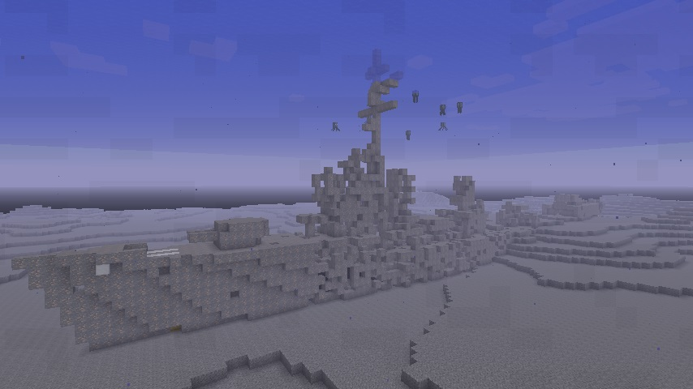
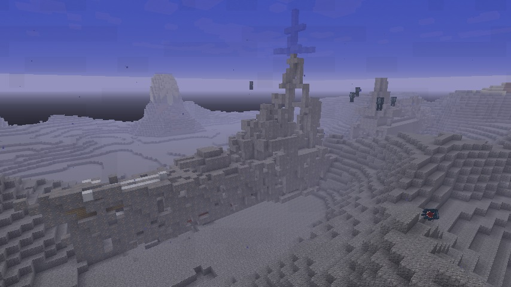
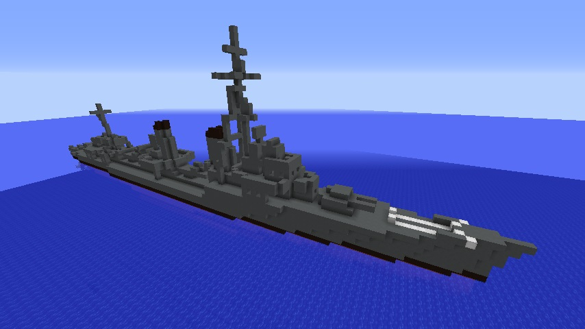
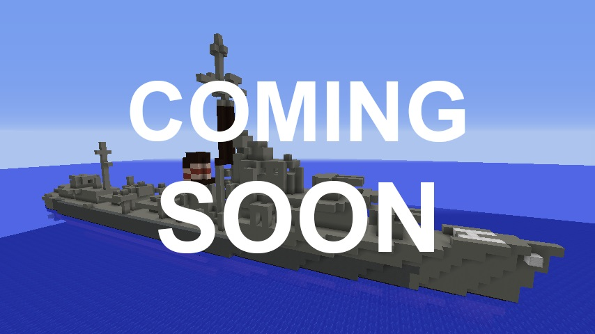

# SunkenNavalShips
https://github.com/Iunius118/SunkenNavalShips

## 生成される沈没艦 (v 1.1.0)
### 駆逐艦 A 型
実際の生成例  

沈没前のイメージ  

艦首楼と艦尾に127 mm連装砲を1基ずつ装備し、艦中央部に口径の大きい610 mmの4連魚雷管を2基と各管用の魚雷装填装置を装備しているのが特徴。
前部マストが残存していれば特徴的なV字の斜桁を見ることができる。

- 全長 120 m
- 最大幅 11 m
- 体積 6161 ブロック
- 2軸推進、ボイラー 3基、タービン 2基（集中配置）
- 127 mm 砲 2門×2基
- 610 mm 魚雷管 4門×2基
- Y砲 爆雷投射機 1基
- 爆雷投下軌条 2基

### 駆逐艦 B 型
実際の生成例  

沈没前のイメージ  

口径の大きい150 mm砲を艦首楼に連装で1基と艦尾に単装で2基装備し、艦中央部に533 mmの4連魚雷管を2基装備しているのが特徴。前部マストが残存していれば特徴的なX字の桁を見ることができる。

- 全長 128 m
- 最大幅 11 m
- 体積 7291 ブロック
- 2軸推進、ボイラー 6基、タービン 2基（シフト配置）
- 150 mm 砲 2門×1基、1門×2基
- 533 mm 魚雷管 4門×2基
- 爆雷投射機 4基

## 実装予定の沈没艦
### 駆逐艦 C 型
実際の生成例  

沈没前のイメージ  

平甲板型の船型、127mm 単装砲を艦首に2 基と艦尾に3基装備し、艦中央部に533 mmの5連魚雷管を2基装備しているのが特徴。前部マストが残存していれば最上部に対空捜索用レーダーのアンテナを見ることができる。

- 全長 115 m
- 最大幅 11 m
- 体積 5997 ブロック
- 2軸推進、ボイラー 4基、タービン 2基（シフト配置）
- 127 mm 砲 1門×5基
- 533 mm 魚雷管 5門×2基
- K砲 爆雷投射機 6基
- 爆雷投下軌条 2基

### 駆逐艦 D 型
実際の生成例  

沈没前のイメージ  

一本の集合煙突、120 mm連装砲を艦首楼に2基と艦尾に1基装備し、艦中央部に533 mmの5連魚雷管を2基装備しているのが特徴。前部マストが残存していれば特徴的なトラス構造のマストを見ることができる。

- 全長 110 m
- 最大幅 11 m
- 体積 6515 ブロック
- 2軸推進、ボイラー 2基、タービン 2基（集中配置）
- 120 mm 砲 2門×3基
- 533 mm 魚雷管 5門×2基
- 爆雷投射機 2基
- 爆雷投下軌条 1基

---
Copyright 2018 Iunius118
