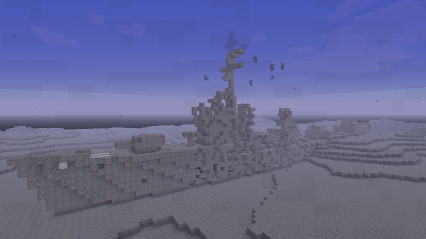
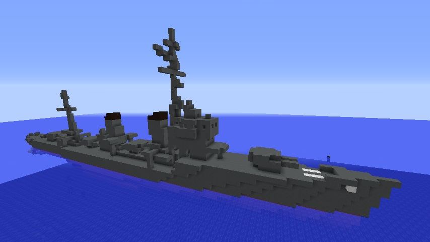
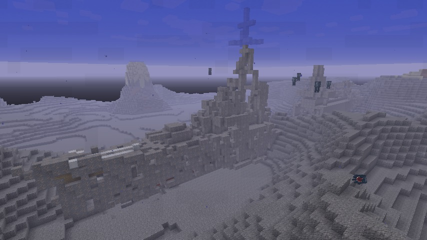
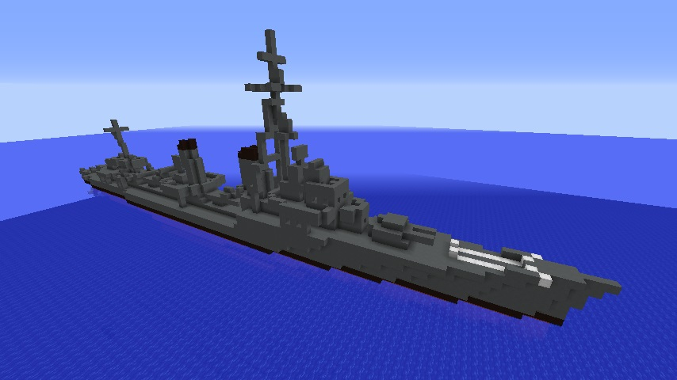
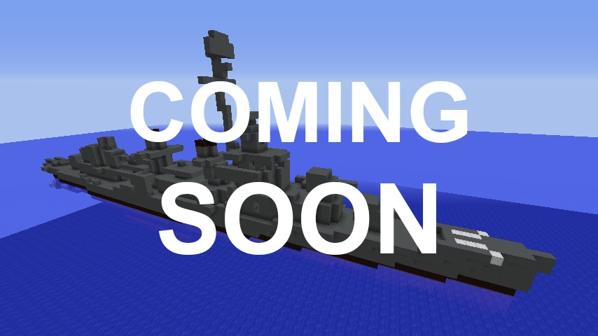

# SunkenNavalShips
https://github.com/Iunius118/SunkenNavalShips

## 実装されている沈没艦 (v 1.1.0)
### 駆逐艦 A 級
実際の生成例  

沈没前のイメージ  

艦首楼と艦尾に127 mm連装砲を1基ずつ装備し、艦中央部に口径の大きい610 mmの4連魚雷管を2基と各管用の魚雷装填装置を装備しているのが特徴。
前部マストが残存していれば特徴的なV字の斜桁を見ることができる。

- 全長 120 m
- 最大幅 11 m
- 体積 6161 ブロック
- 127 mm 砲 2門×2基
- 610 mm 魚雷管 4門×2基
- Y砲 爆雷投射機 1基
- 爆雷投下軌条 2基

### 駆逐艦 B 級
実際の生成例  

沈没前のイメージ  

口径の大きい150 mm砲を艦首楼に連装で1基と艦尾に単装で2基装備し、艦中央部に533 mmの4連魚雷管を2基装備しているのが特徴。前部マストが残存していれば特徴的なX字の桁を見ることができる。

- 全長 128 m
- 最大幅 11 m
- 体積 7291 ブロック
- 150 mm 砲 2門×1基、1門×2基
- 533 mm 魚雷管 4門×2基
- 爆雷投射機 4基

## 未実装の沈没艦
### 駆逐艦 C 級
実際の生成例  

沈没前のイメージ  

平甲板型の船型、127mm 単装砲を艦首に2 基と艦尾に3基装備し、艦中央部に533 mmの5連魚雷管を2基装備しているのが特徴。前部マストが残存していれば最上部に対空捜索用レーダーのアンテナを見ることができる。

- 全長 115 m
- 最大幅 11 m
- 体積 5997 ブロック
- 127 mm 砲 1門×5基
- 533 mm 魚雷管 5門×2基
- K砲 爆雷投射機 6基
- 爆雷投下軌条 2基

### 駆逐艦 D 級
実際の生成例  

沈没前のイメージ  

一本の集合煙突、120 mm連装砲を艦首楼に2基と艦尾に1基装備し、艦中央部に533 mmの5連魚雷管を2基装備しているのが特徴。

- 全長 ??? m
- 最大幅 ?? m
- 体積 ???? ブロック
- 120 mm 砲 2門×3基
- 533 mm 魚雷管 5門×2基
- 爆雷投射機 2基
- 爆雷投下軌条 1基

Copyright 2018 Iunius118
